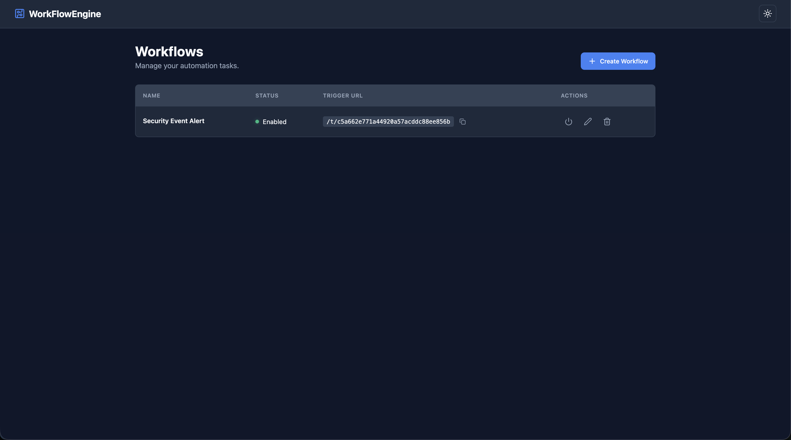
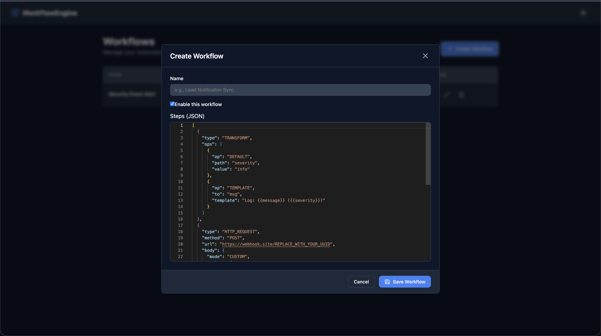
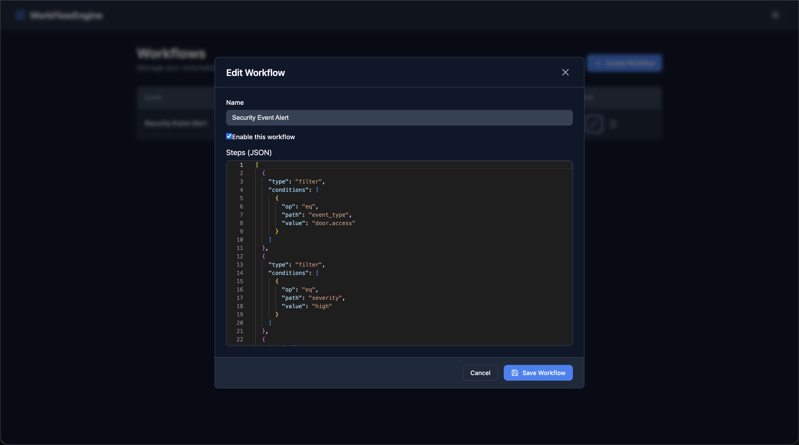
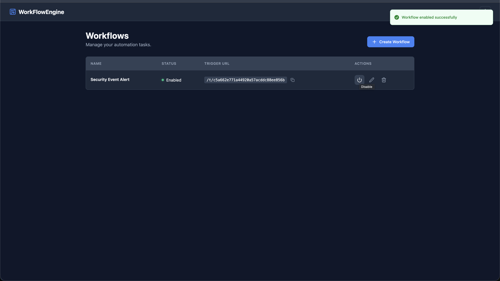
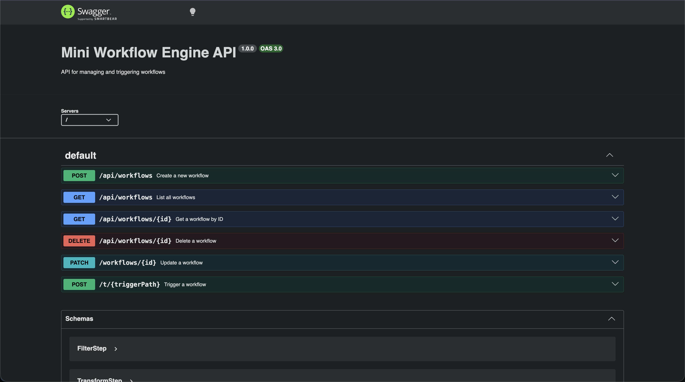

# Mini Workflow Engine

A lightweight, feature-rich workflow automation engine built with Node.js, Express, Next.js, and PostgreSQL. It allows users to define, manage, and execute multi-step workflows triggered via HTTP requests.

## 🚀 Quick Start

The project includes a convenient development script to automate the setup and execution process.

### Prerequisites

- **Node.js**: v18 or later
- **Docker & Docker Compose**: For running the PostgreSQL database

### 1. Initial Setup

To install dependencies and set up environment files, run:

```bash
chmod +x dev.sh
./dev.sh --init
```

This will:

- Create `.env` files from `.env.example` in both `frontend` and `backend` directories.
- Install npm dependencies for both applications.

### 2. Running Local Development

To start the database, run migrations, and launch both frontend and backend servers:

```bash
./dev.sh
```

**Note:** Ensure Docker is running before executing this command. The script will automatically:

- Start the PostgreSQL container via `docker-compose`.
- Generate Prisma client and apply database migrations.
- Start the backend server on [http://localhost:4000](http://localhost:4000).
- Start the frontend server on [http://localhost:3000](http://localhost:3000).

---

## 🛠 Project Structure

- **/backend**: Express.js API with Prisma ORM.
- **/frontend**: Next.js application with React Query and Monaco Editor.
- **/docker-compose.yml**: Defines the PostgreSQL database service.
- **dev.sh**: Main entry point for development tasks.

## 🐳 Docker Configuration

The database is managed via Docker Compose. If you need to manage the database separately:

```bash
# Start only the database
docker-compose up -d

# Stop the database and remove volumes
docker-compose down -v
```

## 🖼 UI Previews

Below are some previews of the Mini Workflow Engine in action:






## 📖 API Documentation

Once the backend is running, you can access the Interactive Swagger UI at:
[http://localhost:4000/api-docs](http://localhost:4000/api-docs)



## 🧪 Testing

### Backend Tests

```bash
cd backend
npm test
```

### Frontend Tests

```bash
cd frontend
npm test
```

---

## 📚 Documentation

For more detailed information about the project's design, constraints, and requirements, please refer to the following documents:

- [Requirements](./docs/REQUIREMENTS.md)
- [Assumptions & Trade-offs](./docs/ASSUMPTIONS.md)
- [Technical Specifications](./docs/tech-specs.md)
